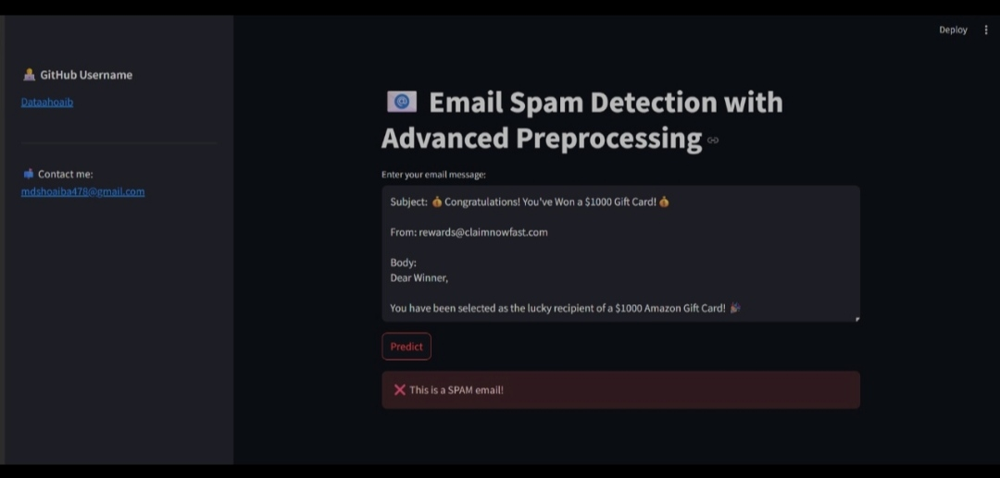

# 📧 Email Spam Detection with Advanced Preprocessing

A machine learning-powered web app to detect **spam emails** using advanced preprocessing and classification techniques. Just input the email content and find out instantly whether it's **Spam** or **Not Spam** — all through an elegant UI built using **Streamlit**.



---

## 🚀 Features

- ✉️ Input complete email text (subject, from, body)
- 🔍 Advanced text cleaning and NLP preprocessing
- 🤖 ML model trained to detect spam with high precision
- 🎯 Accuracy: `97%` | Precision: `1.0`
- 🖥️ Web interface using Streamlit
- ⚡ Real-time prediction with fast response

---

## 📊 Model Performance

| Metric     | Score |
|------------|-------|
| Accuracy   | 97%   |
| Precision  | 1.00  |
| Recall     | 0.94  |
| F1-Score   | 0.97  |

> ✅ **Precision 1.0** ensures no false positives — spam is detected perfectly.

---

## 📁 Project Structure

```
📦 email-spam-detection
┣ 📁 .streamlit
┣ 📁 saved_models
┣ 📄 app.py
┣ 📄 preprocessing.py
┣ 📄 model_trainer.py
┣ 📄 requirements.txt
┣ 📄 README.md
```

---

## 📦 Tech Stack

- **Python**
- **scikit-learn**
- **Pandas / NumPy**
- **Streamlit**
- **Joblib** (for saving models)
- **nltk**

---

## 🔧 How to Run Locally

Follow these steps to run the project locally:

```bash
# Clone the repo
git clone https://github.com/DataShoaib/email-spam-detection.git
cd email-spam-detection

# Install dependencies
pip install -r requirements.txt

# Launch the Streamlit app
streamlit run app.py
```

---

## 🧠 How It Works

1. **User Input**: Enter email subject, sender, and body
2. **Text Preprocessing**: Clean, tokenize, and vectorize input
3. **Model Prediction**: ML model classifies input as spam/ham
4. **Output**: Instant result with visual feedback

---

## 📌 Use-Cases

- Email spam filtering
- Secure communication in enterprises
- Demo for ML/NLP learning projects
- Deploy as an API or internal tool

---

## 🔮 Future Improvements

- 📬 Gmail/Outlook API integration
- 🌍 Support for multilingual spam
- 📈 Real-time training on custom datasets
- 🧪 Ensemble models for even better accuracy

---

## 👨‍💻 Author

**Shoaib Akhtar**  
📧 Email: [mdshoaib478@gmail.com](mailto:mdshoaib478@gmail.com)  
💻 GitHub: [DataShoaib](https://github.com/DataShoaib)

---

## 🙌 Support

If you found this useful, drop a ⭐️ on the [GitHub repo](https://github.com/DataShoaib/email-spam-detection). It motivates and supports open-source work!

---
